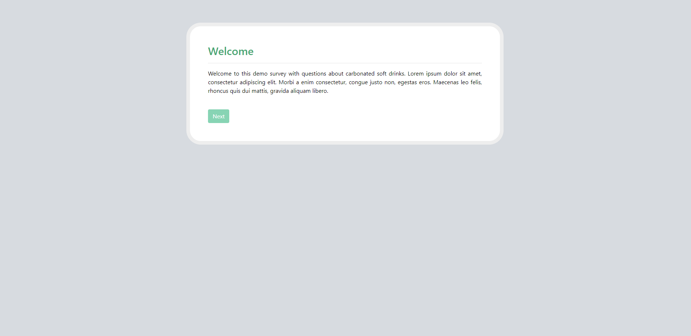
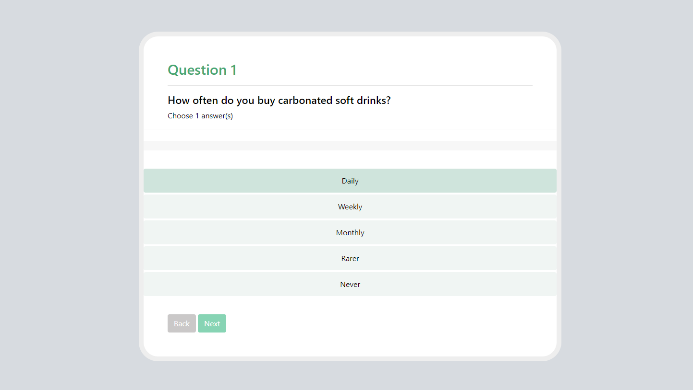
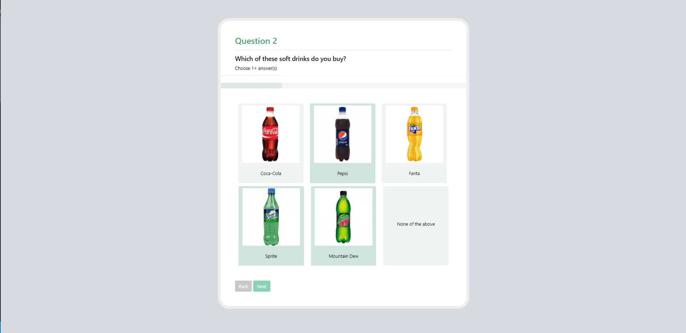
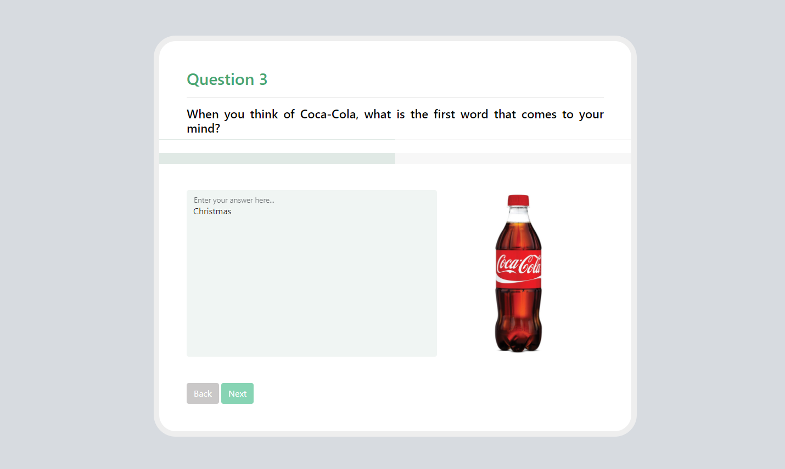
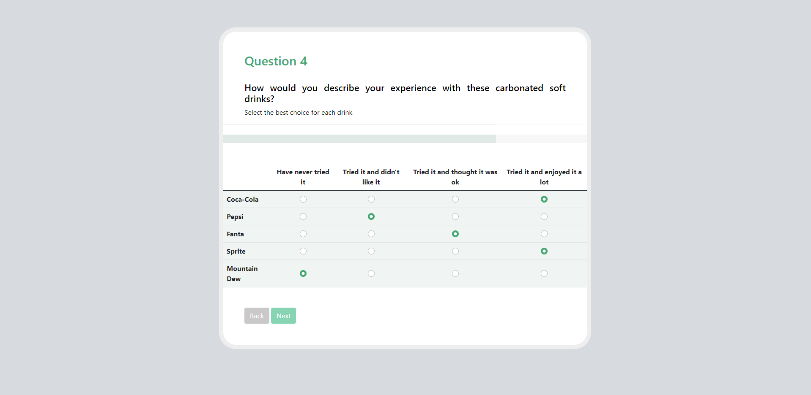
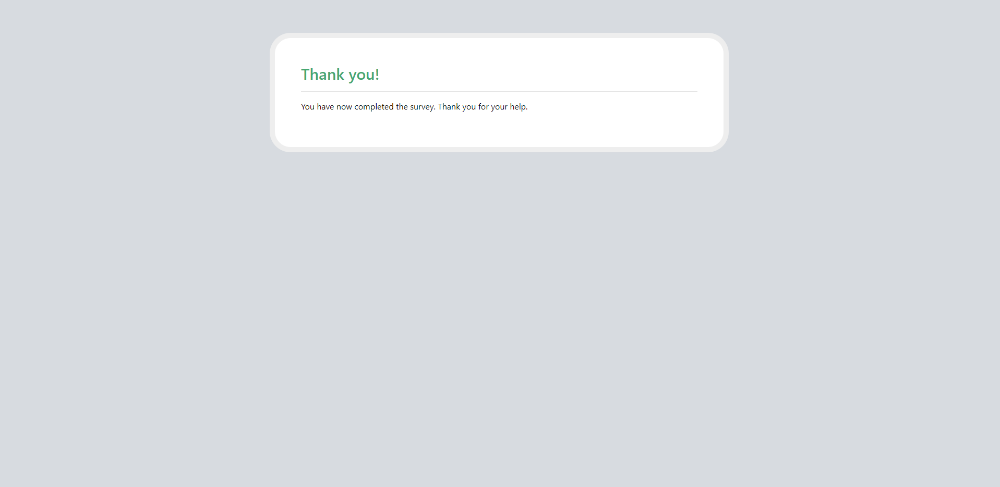

## A Simple Design for a Small Mobile Survey

### Parts of the Survey:

+ Welcome Page

+ Question 1: Single-Choice Question 

+ Question 2: Multi-Choice Question with Choices Containing Images 

+ Question 3: Text-Based Question with One Main Image

+ Question 4: Matrix Question

+ Thank You Page

### View of the Survey

In order to view the survey, clone this repository to you local device and open the `index.html` file in your browser. If it has been opened from your local directory in which you have cloned the full repository, you should be able to move between the pages via main `Next` and `Back` buttons.

# The Survey Design

**Welcome Page -** `index.html`

**Question 1 -** `question_1.html`

**Question 2 -** `question_2.html`

**Question 3 -** `question_3.html`

**Question 4 -** `question_4.html`

**Thank You Page -** `thank_you.html`

# Reflections

The design was intended to be made as simple as possible, so that the user could concentrate on the survey's questions instead of the distracting details of the design.

Design is responsive and can adapt to any screen size, including mobile phones and tablets.

### Colors

Colors have been picked to be pastel and quite minimalistic with only a few brighter details to better redirect user's attention. 

All colors are stored in the `css/style.css` stylesheet as the root values and therefore can easily be changed for the whole survey.

### Limitations

This survey prototype has been built by using only pure `HTML`, `CSS` and `Bootstrap`, thus it lacks some functionalities that could be easily improved by implementing `JavaScript` in the code.

**Some of such possible improvements:**

+ Disabling the `Next` button until the required amount of answers have been selected / filed, in order to prevent the user from skipping the questions without properly answering them.

+ If the question contains the option of `None of the above` or similar (like seen in Question 2), by selecting it, all previously selected choices in that section should be unselected. Otherwise it allows the user to provide contradictory answers.

+ Visually moving progress bar. Currently the progress bar is hard to notice, since it updates its progress with every page, without the update process being visible. The ability to see your progress bar increasing with the help of simple animation could be a part of a more exciting and pleasant experience for the user.

+ In general the code itself is fairly redundant and most of the redundancies could be illuminated with the help of `JavaScript`.